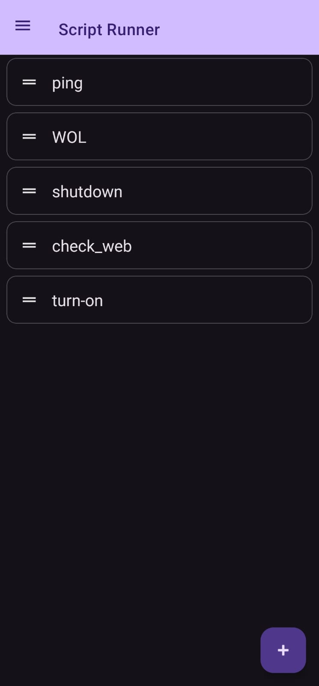
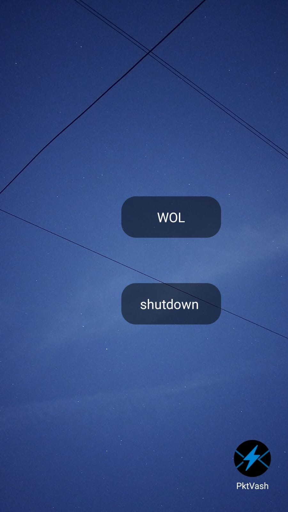
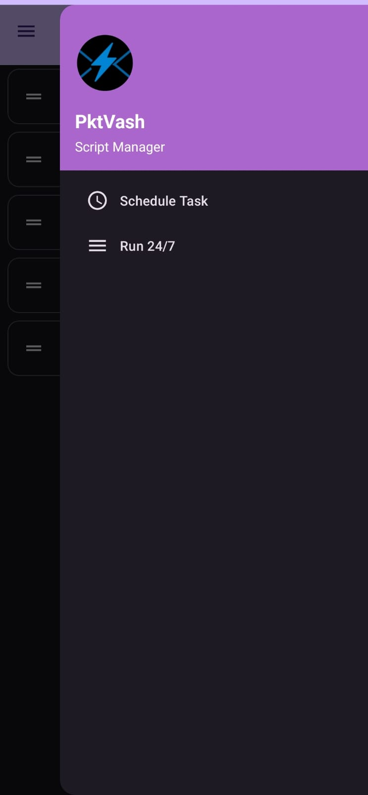
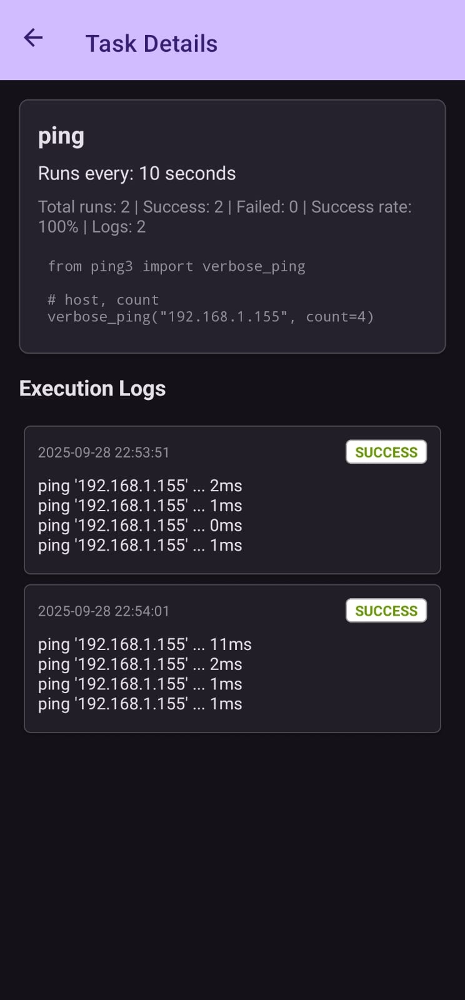

# PktVash (Android)

An Android-based Python IDE for running and automating scripts directly on your device.  
Designed for quick networking tasks, automation, and simple script execution with minimal setup.  

---

## 📦 Installation

1. Download the latest `.apk` from the [Releases](https://github.com/ghostspidy227/PktVash/releases/tag/v1.0.0) page.
2. Transfer it to your Android device (or download directly on the device).  
3. Enable installation from unknown sources (if not already enabled).  
4. Install the APK and open the app.  

---

## 🚀 Features

- **Run saved scripts with one tap**  
  Launch scripts directly from the main interface.  

- **Home screen widget**  
  Quickly execute a script from your home screen without opening the app.  

- **Scheduling**  
  Set scripts to run every `5s`, `5min`, `1hr`, etc.
  View logs of each execution to monitor progress and results.  

- **24/7 Mode**  
  Keep a script running continuously (useful for bots, servers, or long-running tasks).  

- **Drag-and-drop script ordering** *(experimental)*  
  Reorder scripts on the main screen. *(Currently a bit buggy — may not always behave as expected.)*  

---

## ⚡ Usage Notes

- **If using Scheduling or 24/7 Mode:**  
  - Remove battery restrictions for the app.  
  - Ensure background activity is allowed.  

- **If NOT using these features:**  
  - Keep restrictions ON to save battery.  

---

## 📸 Screenshots

| Main Screen | Widgets | Scheduler&24/7 | scheduled-logs |
|-------------|---------|-----------|-----------|
|  |  |  |  |

---

## 📥 Download

👉 [Get the latest APK here](https://github.com/ghostspidy227/PktVash/releases/tag/v1.0.0)  

---

## ⚠️ Disclaimer

- This app is for personal/experimental use.  
- No user input functionality is supported inside scripts.  

